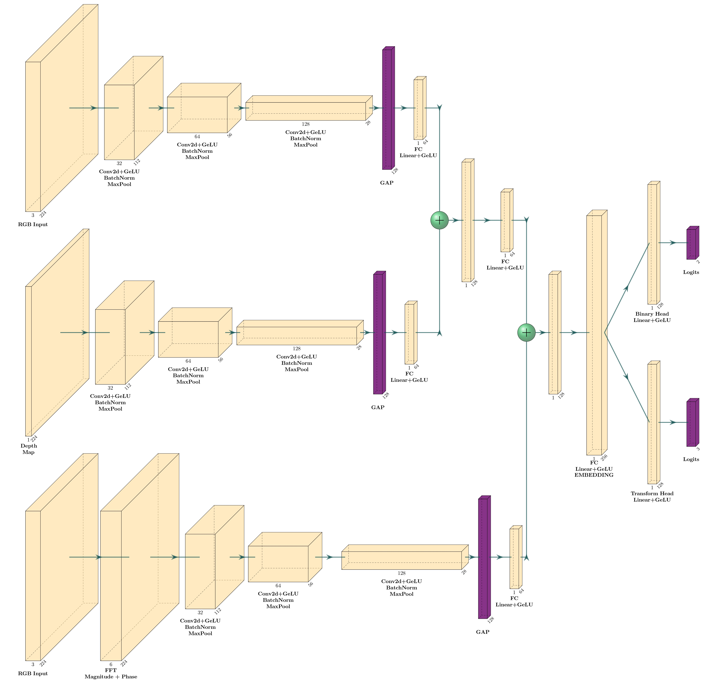
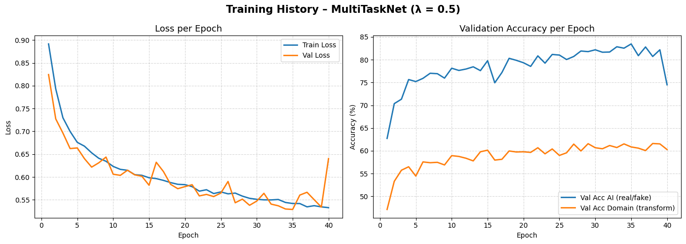
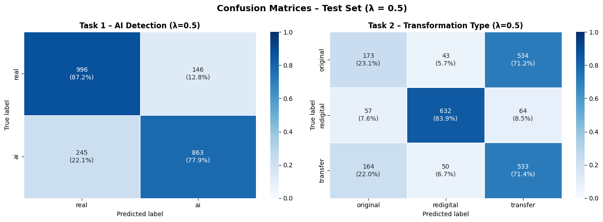
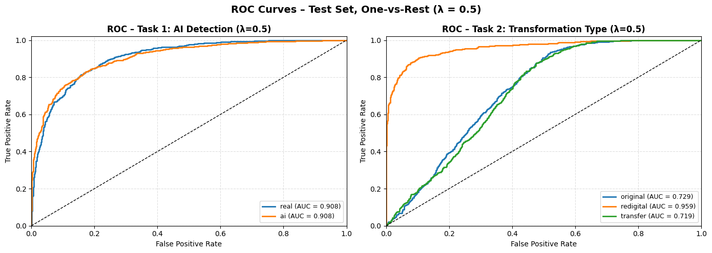
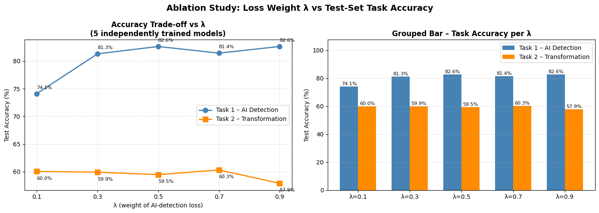
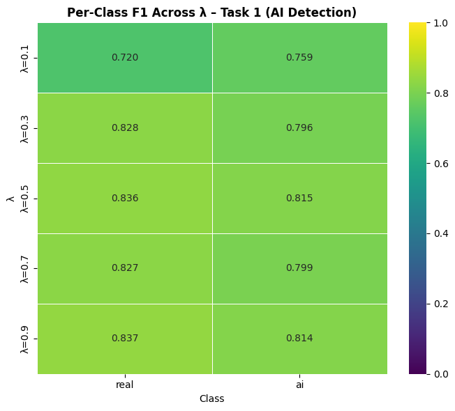
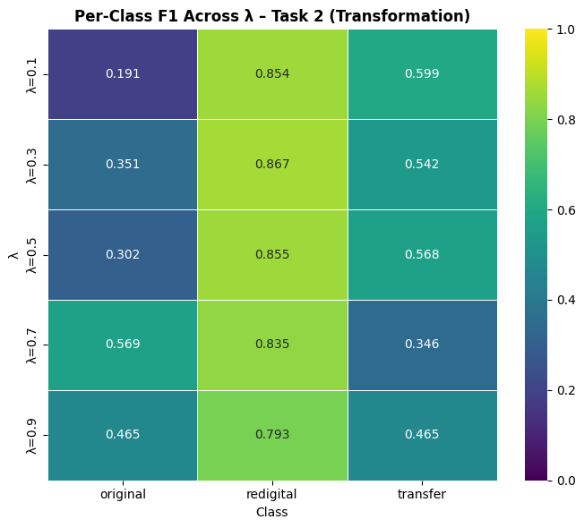
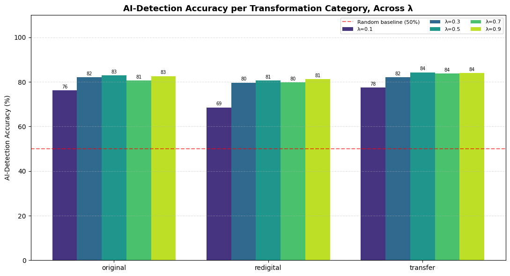
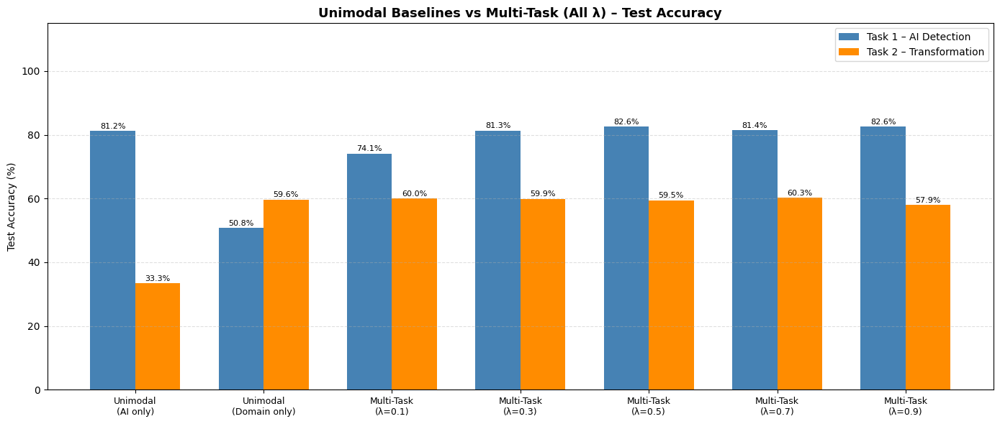

# Joint Detection of AI-Generated Images and Post-Processing Alterations

### Course Information
* **Institution:** Sapienza University of Rome
* **Course:** Computer Vision (M.Sc. in Engineering in Computer Science & Artificial Intelligence)
* **Academic Year:** 2025/2026
* **Professor:** Prof. Irene Amerini
* **Authors:** [Benvenuto Ida Francesca 2045045, Casolino Ilaria 2079322, Giamberardini Matteo 2045678]

---

This project implements a **unified multi-task deep learning framework** that simultaneously addresses two tasks: detecting whether an image is real or AI-generated, and identifying which post-processing alteration has been applied to it. To understand how the two tasks interact, five models are trained from scratch with different values of $\lambda$, and their results are compared against two baselines that each focus on a single task.

---

## Table of Contents

- [Problem Statement](#problem-statement)
- [Dataset](#dataset)
  - [The RRDataset](#the-rrdataset)
  - [Dataset Balancing and Splits](#dataset-balancing-and-splits)
  - [Depth Maps](#depth-maps)
- [Proposed Method](#proposed-method)
  - [Architecture Overview](#architecture-overview)
  - [Offline Depth Pre-Computation](#offline-depth-pre-computation)
  - [FourierNet Branch and Log-Magnitude Input](#fouriernet-branch-and-log-magnitude-input)
  - [RGB and Depth Branches](#rgb-and-depth-branches)
  - [Hierarchical Multi-Stage Fusion](#hierarchical-multi-stage-fusion-rgb-d-and-fourier)
  - [Classification Heads](#classification-heads)
  - [Multi-Task Loss and Lambda](#multi-task-loss-and-weighting-parameter-lambda)
  - [Unimodal Baselines](#unimodal-baselines)
- [Experimental Setup](#experimental-setup)
- [Model Evaluation](#model-evaluation)
  - [Learning Curves — λ = 0.5](#learning-curves--λ--05)
  - [Confusion Matrices — λ = 0.5](#confusion-matrices--λ--05)
  - [ROC Curves and AUC — λ = 0.5](#roc-curves-and-auc--λ--05)
  - [Lambda Trade-off Curve](#lambda-trade-off-curve)
  - [Per-Class F1 Across Lambda](#per-class-f1-across-lambda)
  - [Domain Accuracy Breakdown Across Lambda](#domain-accuracy-breakdown-across-lambda)
  - [Comprehensive Evaluation Summary Table](#comprehensive_evaluation_summary_table)
  - [Unimodal Baselines vs Multi-Task](#unimodal-baselines-vs-multi-task)
- [Repository Structure](#repository-structure)
- [Requirements](#requirements)
- [How to Run](#how-to-run)
- [References](#references)

---

## Problem Statement

Nowadays, generative models can produce photorealistic images. These images look real to the human eye, which makes it easy to spread fake information. Computer vision researchers try to build automated detectors to distinguish real camera photographs from AI-generated fakes.

In the real world, this task is extremely difficult because images do not remain in their original, clean state but, it has almost always undergone some form of **post-processing**. For example:
* **Internet Transfer:** Uploading a photo to social media platforms (like Instagram or WhatsApp) automatically resizes the image and applies lossy **JPEG compression** to save storage space.
* **Re-digitalisation:** A user might print the digital image onto physical paper and then re-photograph it with a smartphone or scan it back into a computer.

These operations alter the pixel values, removing the traces (like camera sensor noise) that detectors use to identify fakes.

### Our Solution
This project builds a unified neural network, called **MultiTaskNet**, to answer two questions simultaneously from a single input image:

| Task | Type | Classes |
|---|---|---|
| **Task 1 — AI Detection** | Binary classification | `real` / `ai` |
| **Task 2 — Transformation Classification** | Multi-class classification | `original` / `redigital` / `transfer` |

(Three-class classification: `original` for no changes, `redigital` for printed-and-scanned, and `transfer` for compressed social media images).

Instead of treating these tasks separately, we use **Multi-Task Learning (MTL)**. By training one network on both tasks, the model learns a shared representation.

---

## Dataset

### The RRDataset
We use the **RRDataset** (*Real/Redigital* dataset) to train and test our model. The images in this dataset are organized into five categories:

1. **AI Label (Task 1):**
   * `real`: Genuine photos taken by cameras.
   * `ai`: Images generated by AI models.
2. **Domain Label (Task 2):**
   * `original`: Digital native images with no alterations.
   * `redigital`: Images printed on paper and re-digitised using a scanner or camera.
   * `transfer`: Digital images subjected to internet compression and resizing.

Combining these categories yields **six distinct subgroups**:
* Original Real & Original AI
* Redigital Real & Redigital AI
* Transfer Real & Transfer AI

```
RRDataset_test/
├── original/
│   ├── ai/
│   └── real/
├── redigital/
│   ├── ai/
│   └── real/
└── transfer/
    ├── ai/
    └── real/
```

### Dataset Balancing and Splits
To ensure the model does not develop a bias towards any class (e.g., predicting "real" just because there are more real images in the dataset), we restrict the total dataset size at **15,000 samples**, ensuring an equal distribution across all classes.

We split this balanced dataset using a fixed random seed into:
* **Training Split (70%):** used to train the network.
* **Validation Split (15%):** used to tune hyperparameters and apply early stopping.
* **Test Split (15%):** used only for final, unbiased evaluation.

### Depth Maps
To save GPU memory and training time, we pre-computed all depth maps once before training using **Depth Anything V2 (Small)**. These are saved to disk in a separate directory (`RRDataset_depth/`) as `.pt` files. During training, the dataloader loads the RGB image and its corresponding pre-computed `.pt` depth tensor.

> **The dataset is not included in this repository.** See [How to Run](#how-to-run) for download instructions.

---

## Proposed Method

### Architecture Overview
`MultiTaskNet` contains three parallel branches, intermediate fusion between RGBNet and DepthNet feature vectors, late fusion with FourierNet and two independent classification heads at the end.


---

### Offline Depth Pre-Computation
Instead of running MDE in real time during training, we pre-compute depth maps offline:
* Load the pre-trained Depth Anything V2 (Small) model.
* Compute the Forward Pass for each RGB image to get a 2D depth map.
* Interpolate the map to 224x224 and normalize values to `[0, 1]`.
* Save the map as a `.pt` tensor.

---

### FourierNet Branch
The frequency branch converts the RGB image into the frequency domain:
1. **FFT:** Apply the 2D Fast Fourier Transform to the 3-channel RGB image.
2. **Log-compression:** Apply `log(|X| + 1)` to the magnitude spectrum to scale down the dominant low-frequencies components, making the higher-frequency patterns visible.
3. **Concat:** Concatenate the magnitude and phase spectrum along the channel dimension, producing a 6-channel input tensor (shape `[B, 6, 224, 224]`).

This tensor is processed by `FourierNet` (three convolutional blocks with ReLU activations, global average pooling, and a fully connected layer), outputting a **64-dimensional frequency embedding**.

---

### RGB and Depth Branches
* **RGBNet** processes the 3-channel RGB image to extract spatial colours and textures, outputting a 64-dimensional spatial embedding.
* **DepthNet** processes the 1-channel pre-computed depth map to extract 3D volumetric shapes, outputting a 64-dimensional geometric embedding.

These two branches are structurally identical (three convolutional blocks with GELU activations, global pooling, and fully connected bottleneck) but **never share weights** to prevent colour information from contaminating geometric feature extraction.

---

### Hierarchical Multi-Stage Fusion (RGB-D and Fourier)
We fuse the three 64-dimensional embeddings in two steps:

1. **Intermediate Spatial Fusion (RGB $\oplus$ Depth):**
   We concatenate the RGB and depth embeddings (64 + 64 = 128 dimensions) and project them to 64 dimensions using `fc_stage2` (Linear(128, 64) + GELU + Dropout(0.3)). We fuse them early because both RGB and depth represent spatial pixel coordinates, allowing the model to learn spatial relationships.
2. **Late Frequency Fusion (Visual-Geometric $\oplus$ Fourier):**
   We concatenate the 64-dimensional visual-geometric embedding and the 64-dimensional Fourier embedding (64 + 64 = 128 dimensions) and project them to the final 256-dimensional representation using `fc_stage3` (Linear(128, 256) + GELU + Dropout(0.3)). We use late fusion here because the Fourier spectrum represents global frequency statistics and has no spatial coordinates. Merging it earlier would disrupt the spatial information of the RGB and Depth CNNs.

---

### Classification Heads
The 256-dimensional fused embedding is sent to two separate heads:
* **Binary Head (AI Detection):** LayerNorm(256) → Linear(256, 128) → GELU → Dropout(0.4) → Linear(128, 2). Outputs logits for `{real, ai}`.
* **Transform Head (Post-Processing Classification):** LayerNorm(256) → Linear(256, 128) → GELU → Dropout(0.4) → Linear(128, 3). Outputs logits for `{original, redigital, transfer}`.

---

### Multi-Task Loss and weighting parameter Lambda
We optimize the model using a combined loss function:

$$\mathcal{L} = \lambda \cdot \mathcal{L}_{\text{AI}} + (1 - \lambda) \cdot \mathcal{L}_{\text{domain}}$$

Where:
* $\mathcal{L}_{\text{AI}}$ is the Cross-Entropy loss for Task 1.
* $\mathcal{L}_{\text{domain}}$ is the Cross-Entropy loss for Task 2.
* $\lambda \in [0, 1]$ is the scalar weighting parameter that controls the trade-off between the two tasks.

Five **fully independent** models are trained from scratch, one for each value of $\lambda = \left\{0.1, 0.3, 0.5, 0.7, 0.9\right\}$. Each model uses a fixed $\lambda$ for its entire training schedule. 

### Unimodal Baselines

Two additional models are trained as baselines for comparison:

- **UnimodalNetAI** ($\lambda = 1.0$): trained on Task 1 only (AI detection)
- **UnimodalNetDomain** ($\lambda = 0.0$): trained on Task 2 only (transformation classification)

These baselines use the same backbone and are trained identically, differing only in which task loss is optimised.

---

## Experimental Setup

| Hyperparameter | Value |
|---|---|
| Optimiser | Adam |
| Learning rate | 1e-4 |
| Batch size | 100 |
| Max epochs | 50 |
| Early stopping patience | 5 |
| Seed | 42 |

---

## Model Evaluation

The test set is the same for all seven models (5 multi-task + 2 unimodal), enabling direct comparison. 
 
### Learning Curves — $\lambda$ = 0.5


 
#### Loss per Epoch (Left Graph)

**What it shows:** Training and validation loss over the 40 epochs run before early stopping (triggered at epoch 40, best checkpoint at epoch 35 with val_loss = 0.5289).
 
**Observation:** Both curves decrease steadily and stay very close to each other. There is no sign of overfitting, meaning the model is actually learning general patterns rather than just memorising the training images.

#### Validation Accuracy per Epoch (Right Graph)

**What it shows:** The validation accuracy for the two tasks: **Task 1** (AI detection, blue curve) and **Task 2** (Domain/Transformation classification, orange curve).

**Observation (Task 1 - Blue):** The accuracy for detecting AI images starts at 63% and jumps quickly above 75% in the first 5 epochs. It continues to rise with some minor oscillations, peaking at **83.5% at epoch 35**. At epoch 40, it drops significantly to 74.5%, which matches the loss spike on the left graph and proves why stopping at epoch 35 was the right choice.

**Observation (Task 2 - Orange):** The domain classification accuracy starts at 47% (which is already much better than a 33.3% random guess for 3 classes) and increases very smoothly, settling around **60-61.5%** in the final epochs.
 
---
 
### Confusion Matrices — $\lambda$ = 0.5


 
**What it shows:** Confusion matrices for both tasks on the test set. Each cell shows the absolute count of predicted classes.

**Observation — Task 1 (AI Detection):** At $\lambda= 0.5$ , the model reaches 82.62% accuracy on the test set. Real images are classified with 87.22% recall, while AI images reach 77.89% recall. The asymmetry suggests the model is somewhat conservative, it tends to lean toward "real" when uncertain, which is the safest choice.

**Observation — Task 2 (Transformation Classification):** The most interesting pattern here is how differently the three classes behave. 

`redigital` is by far the easiest to classify correctly: precision 87.17%, recall 83.93%, F1 85.52%. This makes complete sense, indeed re-digitalization effects are more associated with colour changes and loss of light and shadow details making these features more evident. Consequently, the network is capable of leveraging these re-digitalization artifacts, specifically targeting colour shifts and the loss of fine details as discriminative features.
 
`original` and `transfer`, on the other hand, are frequently confused with each other: `original` has a recall of only 23.07%, meaning most original images get mislabelled as something else, and most of the errors go toward `transfer`. This is also expected: both are natively digital formats and share very similar frequency fingerprints.
 
---
 
### ROC Curves and AUC — $\lambda$ = 0.5


 
**What it shows:** One-vs-rest ROC curves for both tasks, plotting the True Positive Rate against the False Positive Rate across all possible decision thresholds. The dashed diagonal line represents a random guess (AUC = 0.5). The closer the curve is to the top-left corner, the better the model is at separating the classes.
 
**Observation:** AUC measures how well the model separates the classes regardless of which threshold you pick. For Task 1, the model achieves AUC = 0.8256 (macro), a result that confirms it has learnt a meaningful AI/real boundary and not just exploited a class imbalance. For Task 2, AUC = 0.5751 (macro) reflects the difficulty of the `original` vs `transfer` confusion noted above, the `redigital` curve is much higher, while the other two are closer to the diagonal.
 
---
 
### Lambda Trade-off Curve


 
**What it shows:** Overall test accuracy for Task 1 (AI detection) and Task 2 (transformation classification) plotted as a function of $\lambda$ across the five independently trained models.
 
**Observation:** This analysis evaluates how the loss weighting parameter $\lambda$ affects the performance of both tasks on the test set. As $\lambda$ increases, the model is asked to focus more on AI detection and less on transformation classification. 

The Task 1 curve rises sharply from $\lambda = 0.1$ (74.09%) to $\lambda = 0.5$ (82.62%), then plateaus and even dips slightly at $\lambda = 0.7$ (81.42%) before recovering to 82.62% at $\lambda = 0.9$. The Task 2 curve stays relatively flat between 57.91% and 60.31% across all $\lambda$ values, it does not benefit from being the dominant task, but it also does not collapse when $\lambda$ is high.
 
The two curves do not cross because Task 1 is easier than Task 2, so their baseline accuracies are different. Instead, we look for the best compromise:
1.  **Diminishing Returns for Task 1:** 
    If we set $\lambda = 0.9$, we tell the network to ignore the domain classification task. However, this focus does not make the AI detection any better (it stays at 82.6%), while it hurts the domain classification accuracy (which drops to its lowest at 57.9%).
2.  **Severe Penalty for Low Lambdas:** 
    If we set $\lambda = 0.1$, we focus too much on the domain, causing a massive 8.5% drop in our primary task of detecting AI fakes.
3.  **The Perfect Balance:** 
    At $\lambda = 0.5$, we get the best of both worlds. The model achieves the maximum possible AI detection accuracy (82.6%) while keeping the domain classification accuracy stable and competitive (59.5%). This confirms that a balanced loss allows the shared features in the backbone to support both tasks effectively.
 
| $\lambda$ | Task 1 Acc (AI detection) | Task 2 Acc (Transform) |
|---|---|---|
| 0.1 | 74.09% | 60.04% |
| 0.3 | 81.29% | 59.91% |
| **0.5** | **82.62%** | **59.47%** |
| 0.7 | 81.42% | 60.31% |
| 0.9 | 82.62% | 57.91% |
 
---
 
### Per-Class F1 Across Lambda



 
**What it shows:** These heatmaps display the F1-score for each individual class on the test set across our grid of $\lambda$ values. By looking at specific classes rather than overall accuracy, we can see exactly which categories benefit from the multi-task setup and which ones are in competition.
 
**Observation:**
*   **Task 1 (AI Detection - Left Heatmap):** At $\lambda = 0.1$ (low priority for AI detection), the scores are low. However, once we reach $\lambda \geq 0.3$, the F1-scores for both `real` (~0.83) and `ai` (~0.81) become highly stable. At our chosen setting ($\lambda = 0.5$), the scores are perfectly balanced (F1 `real` = 0.836, F1 `ai` = 0.815).
*   **Task 2 (Transformation Type - Right Heatmap):** 
    *   The `redigital` class maintains a consistently high F1-score (~0.85) at all $\lambda$ levels, proving it is extremely easy to identify.
    *   The `original` (clean digital) and `transfer` (internet compressed) classes show a clear **trade-off (competition)**. At $\lambda = 0.1$ (focus on domain), `transfer` climbs to 0.599 but `original` collapses to 0.191. At $\lambda = 0.7$, the opposite occurs: `original` reaches 0.569 while `transfer` drops to 0.346.
    *   At our selected $\lambda = 0.5$, we achieve the most stable compromise (F1 `original` = 0.302, F1 `transfer` = 0.568).

`original` and `transfer` compete so intensely because they both are purely digital domains. The only difference between a clean native photo (`original`) and a social media upload (`transfer`) is lossy JPEG compression and minor resizing. Because these two domains are highly similar, they compete for the model's attention.

**$\lambda = 0.5$ is the fairest compromise:** 
If we tune the loss too much towards one side, one of the two digital classes completely collapses (e.g., F1 of `original` drops to 0.191 at $\lambda = 0.1$). Setting $\lambda = 0.5$ forces the shared backbone to learn a balanced feature space, preventing either class from failing entirely.

---
 
### Domain Accuracy Breakdown Across Lambda


 
**What it shows:** This grouped bar chart displays the AI detection accuracy (Task 1) separately for each image domain (`original`, `redigital`, `transfer`) across our five trained models. It directly answers the core question: *how well does our model detect AI fakes when the images have been compressed or printed and scanned?*
 
**Observation:** 

*   **The Trend:** For all three categories, the AI detection accuracy increases significantly as the loss weight $\lambda$ moves from 0.1 to 0.3-0.5, and then stabilizes. 
*   **The Domains:** 
    *   `transfer` (internet compressed) is consistently the easiest domain for the model to classify, peaking at **84.34%** at $\lambda = 0.5$.
    *   `redigital` (printed and scanned) is the most challenging domain, starting at 68.53% at $\lambda = 0.1$ and reaching a maximum of **81.27%** at $\lambda = 0.9$.
    *   `original` (clean digital) sits in the middle, reaching **82.93%** at $\lambda = 0.5$.
 
| $\lambda$ | original | redigital | transfer |
|---|---|---|---|
| 0.1 | 76.27% | 68.53% | 77.51% |
| 0.3 | 82.13% | 79.68% | 82.06% |
| **0.5** | **82.93%** | **80.61%** | **84.34%** |
| 0.7 | 80.67% | 79.81% | 83.80% |
| 0.9 | 82.67% | 81.27% | 83.94% |
 
---
 
### Comprehensive Evaluation Summary Table
 
This table is the reference containing all key quantitative metrics computed on the shared test set. It consolidates the overall Accuracy and Macro-F1 scores for both tasks, alongside the specific AI detection accuracies across the three post-processing domains (`original`, `redigital`, `transfer`), for all five trained models.
 
| λ | Task 1 Acc | Task 1 Macro-F1 | Task 2 Acc | Task 2 Macro-F1 | AI acc – original | AI acc – redigital | AI acc – transfer |
|---|---|---|---|---|---|---|---|
| 0.1 | 74.09% | 73.94% | 60.04% | 54.80% | 76.27% | 68.53% | 77.51% |
| 0.3 | 81.29% | 81.15% | 59.91% | 58.63% | 82.13% | 79.68% | 82.06% |
| **0.5** | **82.62%** | **82.56%** | **59.47%** | **57.51%** | **82.93%** | **80.61%** | **84.34%** |
| 0.7 | 81.42% | 81.32% | 60.31% | 58.32% | 80.67% | 79.81% | 83.80% |
| 0.9 | 82.62% | 82.54% | 57.91% | 57.45% | 82.67% | 81.27% | 83.94% |
 
---
 
### Unimodal Baselines vs Multi-Task


 
**What it shows:** A direct comparison between the five multi-task models and two unimodal baselines: `UnimodalNetAI` ($\lambda = 1.0$, trained on AI detection only) and `UnimodalNetDomain` ($\lambda = 0.0$, trained on transformation classification only). All models share the same backbone and training setup. This comparison proves whether joint training helps or hurts performance.
 
**Observation:** 
*   **Unimodal Specialists at Chance Level:**
    *   The AI-only model ($\lambda = 1.0$) reaches 81.2% accuracy on Task 1, but scores exactly **33.3%** on Task 2. This is a random guess for a 3-class problem.
    *   The Domain-only model ($\lambda = 0.0$) reaches 59.6% accuracy on Task 2, but scores **50.8%** on Task 1, which is a random guess for a binary classification task.
*   **The Multi-Task Advantage ($\lambda = 0.5$):**
    *   **Task 1 (AI Detection):** The joint model achieves **82.6%** accuracy, which actually **outperforms** the unimodal AI specialist (81.2%) by 1.4 percentage points.
    *   **Task 2 (Domain Classification):** The joint model achieves **59.5%** accuracy, which is practically identical to the unimodal domain specialist (59.6%).
 
1.  **Preventing Overfitting:** 
    Intuitively, a model like **UnimodalNetAI** should perform best on its single task, but the test results show it actually performs worse, scoring 81.2% compared to the joint model's 82.6%. Without a secondary task, the network easily overfits to the clean, ideal patterns in the training data. Introducing the domain classification task acts as a form of regularization. It forces the shared backbone to learn features that remain stable under compression and scanning, which makes the AI detection much more robust on unseen test data.
2.  **Computational Efficiency:** 
    Training a single **MultiTaskNet** model with $\lambda = 0.5$ allows us to solve both tasks simultaneously without any real compromise. The joint model matches the performance of the specialized domain network (59.5% versus 59.6%) and even outperforms the specialized AI detector. This approach cuts the number of parameters and training time in half, providing a highly efficient alternative to deploying two independent networks.
3.  **Functional Synergy:** 
    The two tasks work together in a complementary way. By learning how an image was altered, such as identifying compression grids or printer noise, the network gets better at separating these post-processing artifacts from the actual generative fingerprints. Understanding the type of degradation helps the model filter out irrelevant noise, which directly improves its ability to judge if the underlying image is a real photograph or an AI-generated fake.
 
---

## Repository Structure

```
.
├── project_definitivo.ipynb
├── assets/
├── presentation/              
├── checkpoints/               
│   ├── model_lambda_0.1.pth
│   ├── model_lambda_0.3.pth
│   ├── model_lambda_0.5.pth
│   ├── model_lambda_0.7.pth
│   ├── model_lambda_0.9.pth
│   ├── unimodal_ai.pth
│   ├── unimodal_domain.pth
│   └── training_histories.json
└── README.md
```

The notebook follows the structure: **Imports → Globals → Utils → Data → Network → Train → Test**.

---

## Requirements

- Python 3.9+
- PyTorch 2.x with CUDA support (strongly recommended)
- torchvision
- transformers (for Depth Anything V2 offline extraction)
- Pillow
- numpy
- matplotlib
- seaborn
- scikit-learn
- tqdm

Install all dependencies with:

```bash
pip install torch torchvision transformers pillow numpy matplotlib seaborn scikit-learn tqdm
```

---

## How to Run

### 1. Clone the repository

```bash
git clone https://github.com/ilaria-casolino/<repo-name>.git
cd <repo-name>
```

### 2. Download the dataset

Download **RRDataset** from [Zenodo](https://zenodo.org/records/14963880) and place it in the project root:

```
RRDataset_test/
├── real/
│   ├── original/
│   ├── redigital/
│   └── transfer/
└── ai/
    ├── original/
    ├── redigital/
    └── transfer/
```

### 3. Extract depth maps (offline, one time only)

Before training, run the offline depth extraction cell in the notebook (Section **Utils → Offline Depth Extraction**). This uses Depth Anything V2 Small to generate `.pt` depth tensors for each image and saves them in `RRDataset_depth/`, mirroring the RGB folder structure.

```
RRDataset_depth/
├── real/
│   ├── original/   ← .pt files, one per image
│   ├── redigital/
│   └── transfer/
└── ai/
    ├── original/
    ├── redigital/
    └── transfer/
```

> This step requires an internet connection on first run to download the Depth Anything V2 checkpoint. Subsequent runs use the cached tensors.

### 4. Run the notebook

```bash
jupyter notebook project_definitivo.ipynb
```

Run all cells in order. The notebook is designed to be executed sequentially from top to bottom.

### 5. Checkpoints

Trained models are saved automatically to `checkpoints/` after each λ run. To skip retraining and run only the evaluation section, ensure the checkpoint files are present and execute only the **Test** section of the notebook.

---

## References

- Li, Chunxiao, et al. "Bridging the Gap Between Ideal and Real-world Evaluation: Benchmarking AI-Generated Image Detection in Challenging Scenarios." ICCV 2025.
- Shao, Rui, Tianxing Wu, and Ziwei Liu. "Detecting and grounding multi-modal media manipulation." CVPR 2023.
- Yang, Lihe, et al. "Depth Anything V2." NeurIPS 2024.
- "Course Lectures and Reference Notes" 
Sapienza University of Rome, A.A. 2025-2026.